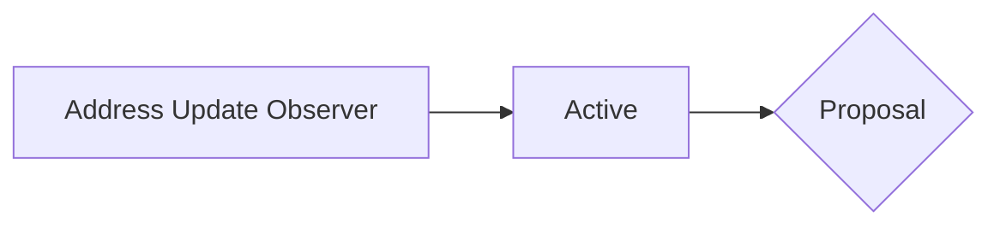

# Cardano-Options

A [p2p-DeFi protocol](https://github.com/zhekson1/CSL-DeFi-Protocols) for writing, buying, and
trading American-style *covered* options contracts on the Cardano Settlement Layer.

> Knowledge of basic Haskell syntax and `cardano-cli` usage is recommended. 

The Getting Started instructions can be found [here](./GettingStarted.md), and the benchmarks can
be found [here](./Benchmarks.md).

## Table of Contents
- [Abstract](#abstract)
- [Motivation](#motivation)
- [The Cardano-Options Protocol](#the-cardano-options-protocol)
    - [Supported Features](#supported-features)
- [Specification](#specification)
    - [The Writer's Address](#the-writers-address)
    - [Proxy Script](#proxy-script)
    - [Telling Time](#telling-time)
    - [Protocol Phases and Beacons](#protocol-phases-and-beacons)
    - [Four Aiken Smart Contracts](#four-aiken-smart-contracts)
    - [Proposal UTxO Actions](#proposal-utxo-actions)
        - [Creating Proposal UTxOs](#creating-proposal-utxos)
        - [Closing Proposal UTxOs](#closing-proposal-utxos)
        - [Updating Proposal UTxOs](#updating-proposal-utxos)
        - [Purchasing Proposal UTxOs](#purchasing-proposal-utxos)
    - [Active UTxO Actions](#Active-utxo-actions)
        - [Executing Active UTxOs](#executing-active-utxos)
        - [Closing Expired Active UTxOs](#closing-expired-active-utxos)
        - [Updating Payment Addresses](#updating-payment-addresses)
- [Benchmarks and Fee Estimations (YMMV)](#benchmarks-and-fee-estimations-ymmv)
- [Features Discussion](#features-discussion)
- [Conclusion](#conclusion)

## Abstract

Cardano-Options is a p2p-DeFi protocol for writing, buying, and trading American-style *covered*
options contracts on the Cardano Settlement Layer (CSL). Users maintain delegation control of assets
at all times. Every aspect of the options contract is fully customizable (eg, which asset will be
offer, used as the premium, etc). Once purchased, the protocol will trustlessly enforce the
specified terms. Finally, as with all other p2p-DeFi protocols, this DApp can be trustlessly
composed with all other Cardano DApps.

## Motivation

Options contracts play a vital role in the economy by providing a mechanism for risk management,
improving market efficiency, and enhancing price discovery. This is especially important for an
endogenous p2p economy that does not rely off-chain price feeds. Currently, there are very few
options markets on Cardano. Those that do exist usually require users to sacrifice custody,
delegation control, and voting control of all assets used for the options contracts. Furthermore,
direct composability with other DApps is rarely considered. These factors increase the risk for all
users who wish to interact with the options market *and* significantly hinder the market's economic
potential.

## The Cardano-Options Protocol

By using the distributed-DApp design (i.e., all users get their own personal DApp addresses) with
beacon tokens, Cardano-Options does not have any of the same limitations as contemporary DApps.

### Supported Features

- **Native Support for All Assets** - all assets are directly supported as offered assets, asked
assets, and premium assets.
- **Direct Payments to Writers** - buyers make payments directly to addresses specified by the
writers. This means writers do not need to wait until after the contract finishes to claim the
proceeds from the premium payments.
- **Assortment of Possible Terms** - when a writer creates a new contract for sale, they can offer a
selection of terms for the buyer to choose from. This enables writers to use more advanced trading
strategies and risk-management techniques.
- **Tradable Contracts** - when a buyer purchases a new contract, they are given a Key NFT for that
new contract. Whoever controls this Key NFT is able to execute the associated options contract. This
Key NFT can be freely traded on *any* DApp, especially those meant to act as secondary markets for
financial assets.
- **A Single DApp Address for Each Writer** - every writer gets their own personal DApp address.
All contracts created by this writer are held in their personal address. This makes it very easy for
front-ends to integrate Cardano-Options as well as for writers to manage the stake/voting power for
assets in the DApp.
- **Efficient Off-chain Sorting of Contracts** - by using beacons tokens, users can easily query the
protocol for any information they may want. These beacon queries can even be combined to create more
complicated queries. For example, buyers can see all current contracts for sale that are offering
DJED, and asking for a premium paid in ADA. 
- **Democratic Upgradability** - users decide if and when to upgrade to a new version of the DApp.
No one can decide this for them, or force them to move to a new version (eg, by freezing all
functionality for the current version).
- **Full Composability** - this protocol is natively composable with all other DeFi DApps. It can
even be composed with itself: an options writer can close an expired contract and immediately create
a new contract for sale in a single transaction.

## Specification

This section is the low-level specification for the protocol. If you are only interested in the
high-level aspects, feel free to skip to the next [section](#benchmarks-and-fee-estimations-ymmv).

### The Writer's Address

Writer each create a unique "options" address - this is where all contract purchases take place *and*
where all collateral is kept until the contract is either executed or expired. As is common in
*distributed dApps*, all such options addresses use the same validator script for the payment
credential, and a unique, user-defined staking key or script for the staking credential.
Owner-related actions are delegated to the staking credential *by* the validator script, so the user
maintains full control of all assets at the address. 

Payments are *not* made to this address. Instead, the payment credential acts as an overseer to
ensure that the payment goes to the address specified in the options contract.

### Proxy Script

Since Cardano-Options has buyers make payments directly to addresses specified by the writers, care
must be taken when the specified address uses a payment plutus script. This is because the protocol
enforces a specific datum with contract payments in order to guarantee uniqueness of outputs - this
is currently the cheapest option for preventing double satisfaction. If the payments with this
enforced datum are sent to an address that requires a different datum, the payment can be locked
forever.

To address this issue, Cardano-Options uses the same Proxy Script as Cardano-Loans. The proxy script
can accept any datum, use any redeemer, and simply delegates spending authorization to the address'
staking credential, which can be anything (eg, a native script, a plutus script, or even a pubkey).

Payment pubkey address are always allowed since they can accept any datum. The proxy script is only
necessary if the writer wishes to use more than just a single pubkey to protect their proceeds. For
example, if the writer wishes to use a multisig, they would use the proxy script as the payment
credential and the native multisig script as the staking credential for their specified payment
address. If the writer wanted more complicated logic to protect their assets, they would use the
proxy script as the payment credential and a plutus script as the staking credential. *The proxy
script must always be paired with a staking credential.* The protocol will disallow any proxy
scripts used without a staking credential.

### Telling Time

Ultimately, the protocol does *not* need to know the current time; it only needs to know whether a
certain time has, or has not, passed.

This is where the validity intervals come in. A smart contract will only ever be run if the validity
interval is true. Therefore, if the invalid-before is set to slot 10 and the smart contract is being
executed, then the smart contract knows that slot 10 is guaranteed to have already passed. Likewise,
if the invalid-hereafter is set to slot 20 and the smart contract is being executed, then the smart
contract knows that slot 20 has definitely *not* passed yet.

Therefore, this protocol uses the following general rules:
- If you need to prove to the smart contract that time `y` has passed, set the invalid-before bound
to `y`.
- If you need to prove to the smart contract that time `x` has *not* passed yet, set the
invalid-hereafter bound to `x`.

### Protocol Phases and Beacons

All actions are largely categorized into two broad phases:

1. *Proposal Phase* - this is when a writer creates a new options contract for sale. It ends when
   the contract is purchased and the associated Key NFT is created.
2. *Active Phase* - this phase starts when a buyer purchases a writer's proposal. During this phase,
   the protocol will enforce all terms set in the proposal phase. This phase ends when either the
contract is executed using the Key NFT or the contract expires.

Each phase has a dedicated UTxO type: Proposal UTxO and Active UTxO.

##### Proposal UTxO Beacons

There is a dedicated beacon minting policy for proposal beacons. Proposal UTxOs have four dedicated
beacons:

- *Offer Asset Beacon* - a proposal phase beacon token representing which asset can be taken when
the contract is executed. It has the token name: `sha2_256("01" ++ asset_policy_id ++
asset_token_name)`.
- *Ask Asset Beacon* - a proposal phase beacon token representing which asset must be paid to the
writer when the contract is executed. It has the token name: `sha2_256("02" ++ asset_policy_id ++
asset_token_name)`.
- *Premium Asset Beacon* - a proposal phase beacon token representing which asset must be paid to
the writer for the premium. It has the token name: `sha2_256("03" ++ asset_policy_id ++
asset_token_name)`.
- *Trading Pair Beacon* - a proposal phase beacon token representing which assets are being traded
in the contract, and which direction the trade is going in. It has the token name: `sha2_256(
offer_id ++ offer_name ++ ask_id ++ ask_name )`. However, in the case where one of the assets is ada
(which is just the empty bytestring), the ada policy id is set to "00" instead. For example, an ADA
-> DJED contract pair beacon would be: `sha2_256(djed_id ++ djed_name ++ "00" ++ "")`. Without this
change, each direction would not get its own beacon (ie, DJED -> ADA would have the same trading
pair beacon as ADA -> DJED).

##### Active UTxO Beacons

There is a dedicated beacon minting policy for active beacons. Active UTxOs have four dedicated
beacons:

- *Offer Asset Beacon* - an active phase beacon token representing which asset can be taken when the
contract is executed. It has the exact same name as the associated Proposal UTxO's Offer Beacon.
- *Ask Asset Beacon* - an active phase beacon token representing which asset must be paid to the
writer when the contract is executed. It has the exact same name as the associated Proposal UTxO's
Ask Beacon.
- *Trading Pair Beacon* - an active phase beacon token representing which assets are being traded in
the contract, and which direction the trade is going in. It has the exact same name as the
associated Proposal UTxO's Trading Pair Beacon.
- *Contract ID Beacon* - an active phase beacon token uniquely representing this options contract.
Its token name is:  `sha2_256( proposal_utxo_tx_hash ++ proposal_utxo_output_index )`. There are two
of these for each contract: one is stored with the contract and one is the NFT that can be freely
traded among buyers. This Contract ID token pair is called the "Lock & Key NFTs".

The beacon names for each phase are deliberately the same to simplify the off-chain querying.

The 2 Contract ID Beacons act as *Lock & Key NFTs*. One copy is *always* stored with the contract
while the other is the Key NFT that can be freely traded. When the contract is executed, *both*
copies must be burned. Because of this, the Key NFT can act as a proxy for the contract owner's
approval; the Key NFT can only be burned if the owner approved the transaction. Furthermore, it is
trivial for prospective buyers of the Key NFT to look up the associated contract's terms since the
Lock NFT will be have the same name as the Key NFT, and be stored with the contract.

### Four Aiken Smart Contracts

Due to the amount of logic required for this protocol and the desire to minimize the impact from
redundant executions, this protocol uses 4 separate smart contracts; *not all of them are required
with each transaction*. Each smart contract is dedicated to a specific purpose. As a consequence of
this, there are actually two separate minting policies for beacons tokens: one for proposal phase
beacons and one for active phase beacons. Most user actions only required 2 of the 4 contracts in a
single transaction. The most that is ever needed is 3 out of the 4 contracts. However, since these
scripts can be used as reference scripts, there is still plenty of room for DApp composability.

- *Proposal Smart Contract* - this smart contract is in charge of minting/burning beacons for the
proposal phase of the protocol. In addition to being a minting policy, it can also be executed as a
staking script to enable cheaply updating Proposal UTxOs in-place (ie, no beacons need to be
minted/burned, but the new datums need to be checked).
- *Active Smart Contract* - this smart contract is in charge of minting/burning beacons for the
active phase of the protocol. It can only be executed as a minting policy.
- *Address Update Observer Smart Contract* - this smart contract is in charge of observing all
payment address updates. It can only be executed as a staking script.
- *Options Spending Smart Contract* - this smart contract is the payment credential for *all* DApp
addresses. It delegates checks to one of the other 3 smart contracts depending on the action being
taken. It can only be executed as a spending script.

The options spending smart contract hash is hard-coded into *all* of the other smart contracts to
enforce the use of the proper payment credential for all options addresses.

The address observer smart contract hash is hard-coded into the active smart contract so that the
active smart contract can force the use of the proper observer logic. The, the active smart contract
hash is hard-coded into the proposal smart contract so that it can force the use of the proper
active smart contract. The active smart contract hash embodies the observer hash hard-coded into
it so there is no need to also hard-code the observer hash into the proposal smart contract. It
looks like this:


```mermaid
flowchart LR
    1[Address Update Observer] --> 2{Active};
    2[Active] --> 3{Proposal};
```

The protocol's complementary proxy smart contract is hard-coded into the address update observer
smart contract and the proposal smart contract so that payment addresses can be checked for proper
configurations.

The redeemers and datums are introduced here:

##### Options Spending Smart Contract Datums

A DApp UTxO's datum can either be a `ProposalDatum`, or an `ActiveDatum`. `POSIXTime`
is always in milliseconds.

```haskell
-- | The terms that an options' writer can vary within the same Proposal UTxO.
data Terms = Terms
  { premium :: Integer
  , strikePrice :: Rational
  , expiration :: POSIXTime
  }

-- | The datum for an options contract that is available for purchase.
data ProposalDatum = ProposalDatum
  -- | The policy id for the proposal beacon script.
  { proposalBeaconId :: CurrencySymbol
  -- | The policy id for the active beacon script.
  , activeBeaconId :: CurrencySymbol
  -- | The asset being offered.
  , offerAsset :: (CurrencySymbol,TokenName)
  -- | The amount of the offer asset being offered.
  , offerQuantity :: Integer
  -- | The asset being asked for.
  , askAsset :: (CurrencySymbol,TokenName)
  -- | The token name for the trading pair beacon.
  , tradingPairBeacon :: TokenName
  -- | The token name for the offer beacon.
  , offerBeacon :: TokenName
  -- | The token name for the ask beacon.
  , askBeacon :: TokenName
  -- | The asset the premium must be paid in.
  , premiumAsset :: (CurrencySymbol,TokenName)
  -- | The token name for the premium asset beacon.
  , premiumBeacon :: TokenName
  -- | The amount the writer paid for the minUTxOValue.
  , contractDeposit :: Integer
  -- | The address where the premium must go upon purchase of the contract.
  , paymentAddress :: Address
  -- | The possible terms the buyer can pick from.
  , possibleTerms :: [Terms]
  }

-- | The datum for an options contract that has been purchased, and can be executed any time up
-- until the expiration.
data ActiveDatum = ActiveDatum
  -- | The policy id for the proposal beacon script. This is needed to support using the same 
  -- active beacons redeemer for purchases, executions, and closing expired.
  { proposalBeaconId :: CurrencySymbol
  -- | The policy id for the active beacon script.
  , activeBeaconId :: CurrencySymbol
  -- | The hash of the address update observer script.
  , addressObserverHash :: ScriptHash
  -- | The asset being offered.
  , offerAsset :: (CurrencySymbol,TokenName)
  -- | The amount of the offer asset being offered.
  , offerQuantity :: Integer
  -- | The asset being asked for.
  , askAsset :: (CurrencySymbol,TokenName)
  -- | The token name for the trading pair beacon.
  , tradingPairBeacon :: TokenName
  -- | The token name for the offer beacon.
  , offerBeacon :: TokenName
  -- | The token name for the ask beacon.
  , askBeacon :: TokenName
  -- | The strike price for this contract.
  , strikePrice :: Rational
  -- | This contract's expiration.
  , expiration :: POSIXTime
  -- | The amount the writer paid for the minUTxOValue.
  , contractDeposit :: Integer
  -- | The address where the ask asset must go upon execution of the contract.
  , paymentAddress :: Address
  -- | The unique identitier for this contract.
  , contractId :: TokenName
  }
```

##### Options Spending Smart Contract Redeemers
```haskell
data OptionsRedeemer
  -- | Close or update a Proposal UTxO.
  = CloseOrUpdateProposal
  -- | Purchase an options contract by converting a Proposal UTxO into an Active UTxO. The
  -- `desiredTermsIndex` identifies which `Terms` the buyer is purchasing.
  | PurchaseContract { desiredTermsIndex :: Integer }
  -- | Execute an active options contract.
  | ExecuteContract
  -- | Close an active options contract that has expired.
  | CloseExpiredContract
  -- | Update the address where the ask asset must go. Optionally deposit additional ada if needed.
  | UpdatePaymentAddress { newAddress :: Address, depositIncrease :: Integer }
```

##### Address Update Observer Smart Contract Redeemers
```haskell
data AddressObserverRedeemer
  -- | Observer a writer's address update transaction.
  = ObserveAddressUpdate
  -- | Register the script.
  | RegisterAddressObserverScript
```

##### Proposal Smart Contract Redeemers
```haskell
data ProposalBeaconsRedeemer
  -- | Create, close, or update some Proposal UTxOs (1 or more). 
  = CreateCloseOrUpdateProposals
  -- | Burn any beacons. This is only used during contract purchases.
  | BurnProposalBeacons
  -- | Register the script.
  | RegisterProposalScript
```

##### Active Smart Contract Redeemers
```haskell
data ActiveBeaconsRedeemer
  -- | Create some Active UTxOs (1 or more) by buying Proposal UTxOs. The CurrencySymbol is the 
  -- policy id for the proposal beacons.
  = PurchaseExecuteOrCloseExpiredContracts { proposalPolicyId :: CurrencySymbol }
  -- | Burn any beacons. This is only used to burn unused Key NFTs.
  | BurnActiveBeacons
```

By using a single redeemer for purchases, executions, and closing expired contracts, it is possible
to securely compose all three actions in a single transaction. If the actions used separate
redeemers, each transaction using the active beacon smart contract would be forced to be dedicated
to that individual action.

##### Payment Datum

This datum is attached to all direct outputs to payment addresses. It is used to prevent
double-satisfaction.

```haskell
-- | The `CurrencySymbol` is always the active beacon policy id, and the `TokenName` is always
-- the Loan ID this payment output corresponds to.
newtype PaymentDatum = PaymentDatum (CurrencySymbol,TokenName)
```

The `CurrencySymbol` is included to prevent double-satisfaction during DApp composition; just using
the `TokenName` may not be enough to guarantee uniqueness.

### Proposal UTxO Actions

Writers can create/update/close multiple Proposal UTxOse in a single transaction; each UTxO created
can have different terms.

##### Creating Proposal UTxOs

At a high-level, creating Proposal UTxOs involves creating the new UTxOs at the writer's options
address with the desired `ProposalDatum`s, and tagging them with the required beacons. The proposal
beacon smart contract will check all outputs containing proposal beacons to ensure invalid UTxOs are
never broadcast to other users.

At a low-level, all of the following must be true:

- The proposal beacon smart contract must be executed as a minting policy using
`CreateCloseOrUpdateProposals`.
- All outputs with proposal beacons must have exactly four kinds of beacons, with exactly one unit
of each:
    - an Ask Asset Beacon with the token name corresponding to the `askAsset` in the `ProposalDatum`
    - an Offer Asset Beacon with the token name corresponding to the `offerAsset` in the
    `ProposalDatum`
    - a Premium Asset Beacon with the token name corresponding to the `premiumAsset` in the
    `ProposalDatum`
    - a Trading Pair Beacon with the token name corresponding to the `offerAsset` and `askAsset` in
    the `ProposalDatum`
- All outputs with proposal beacons must have a valid inline `ProposalDatum`:
    - `proposalBeaconId` == the proposal smart contract policy id
    - `activeBeaconId` == the proposal smart contract's hard-coded active smart contract hash
    - `offerAsset` == asset that corresponds to the offer asset beacon in this output
    - `offerQuantity` > 0
    - `askAsset` == asset that corresponds to the ask asset beacon in this output
    - `tradingPairBeacon` == token name that corresponds to the trading pair beacon in this output 
    - `offerBeacon` == token name that corresponds to the offer beacon in this output
    - `askBeacon` == token name that corresponds to the ask beacon in this output
    - `premiumAsset` == asset that corresponds to the premium asset beacon in this output
    - `premiumBeacon` == token name that corresponds to the premium asset beacon in this output
    - `contractDeposit` > 0
    - `paymentAddress` must use either a payment pubkey, or the proxy script as the payment
    credential and a valid staking credential
    - `possibleTerms` must not be empty
    - For all `Terms` is `possibleTerms`:
        - `strikePrice` numerator > 0 and denominator > 0
        - `expiration` >= invalid-hereafter of this transaction
        - `premium` > 0
    - `offerAsset` != `askAsset`
- All outputs with proposal beacons must have *exactly* the `contractDeposit` amoung of ada and the
  `offerQuantity` amount of the `offerAsset`. No other assets are allowed in the output.


In order to help prevent creating a bunch of expired contracts to clutter the beacon queries, all
contract expirations must be set to a time that has not passed yet. The invalid-hereafter bound is
used to prove that time x has not passed yet, and all expirations must be >= x. This is how the
smart contract can prove that all of the newly created options contracts are not already expired.

In TradFi, it is possible for writers to create many different contracts backed by the same assets.
Buyers pick which contract they are interested in and the assets get paired with the chosen
contract. To enable this feature, writers can place their desired terms in the `possibleTerms` list.
Only the `expiration`, `strikePrice`, and `premium` are allowed to vary across the assortment. If a
writer does not want to provide an assortment, they can offer only a single `Terms` in
`possibleTerms`.

The `strikePrice` is always Ask/Offer.

##### Closing Proposal UTxOs

At a high-level, closing Proposal UTxOs involves spending the target UTxOs at the writer's options
address, and burning the proposal beacons attached to them. The writer must approve this
transaction. The proposal beacon smart contract will check all beacons are properly burned to ensure
invalid UTxOs are never broadcast to other users.

At a low-level, all of the following must be true:

- The options spending smart contract is executed for the Proposal UTxO input using `CloseOrUpdateProposal`.
- The Proposal UTxO must have a `ProposalDatum`.
- The option address' staking credential must signal approval.
- If the Proposal UTxO being spent contains proposal beacons:
    - The proposal beacon smart contract must be executed as a minting policy using
    `CreateCloseOrUpdateProposals`.

The proposal smart contract will actually do the exact same check as when creating Proposal UTxOs.
However, since closing Proposal UTxOs implies no new Proposal UTxO outputs, there are no outputs to
check.

If there is ever an invalid Proposal UTxO (ie, a Proposal UTxO with a `ProposalDatum` but no
proposal beacons), it can be spent with this method; the proposal smart contract would not need
to be executed. 

##### Updating Proposal UTxOs

Updating Proposal UTxOs in-place can be done regardless of whether beacons must be changed. The
steps are identical to closing Proposal UTxOs, except you know create Proposal UTxO outputs as well.
Since there are now outputs, the outputs will be checked by the proposal beacon script and must
comply to the same requirements as when creating Proposal UTxOs.

If no beacons need to be minted/burned, the proposal beacon script must be executed as a staking
script using `CreateCloseOrUpdateProposals`. If beacons do need to be minted/burned, then the
proposal beacon script must be executed as a minting policy using the same redeemer.

##### Purchasing Proposal UTxOs

At a high-level, purchasing a proposal involves sending the premium payment to the writer's payment
address and creating a new Active UTxO for that contract at the writer's options address. The new
Active UTxO must be tagged with the proper beacons so that it can be easily found off-chain. The
buyer can keep the newly minted Key NFT for this contract.

At a low-level, all of the following must be true:

- The proposal UTxO being purchased must be spent using `PurchaseContract` where the
`desiredTermsIndex` is the 0-based index of the desired `Terms` in the UTxO's `possibleTerms`.
- The UTxO being spent with `PurchaseContract` must have a `ProposalDatum`.
- The UTxO being spent with `PurchaseContract` must have the required proposal beacons.
- The active beacon smart contract must be executed as a minting policy using
`PurchaseExecuteOrCloseExpiredContracts` with the `proposalBeaconId` from the input's
`ProposalDatum`.
- For each proposal purchased, there must be a corresponding contract output with the following
characteristics:
    - It must be locked at the same options address where the Proposal UTxO originates.
    - It must have exactly four Active beacons, one unit of each:
        - The Trading Pair beacon for the associated proposal
        - The Offer beacon for the associated proposal
        - The Ask beacon for the associated proposal
        - The Lock NFT (Contract ID beacon) for the associated proposal
    - It must have the proper inline `ActiveDatum` where:
        - `proposalBeaconId` == `proposalBeaconId` in the active beacon redeemer
        - `activeBeaconId` == active beacon smart contract policy id
        - `addressObserverHash` == the active beacon smart contract's hard-coded address observer
        hash
        - `offerAsset` == `offerAsset` from proposal
        - `offerQuantity` == `offerQuantity` from proposal
        - `askAsset` == `askAsset` from proposal
        - `tradingPairBeacon` == `tradingPairBeacon` from proposal
        - `offerBeacon` == `offerBeacon` from proposal
        - `askBeacon` == `askBeacon` from proposal
        - `contractDeposit` == `contractDeposit` from proposal
        - `paymentAddress` == `paymentAddress` from proposal
        - `strikePrice` == `strikePrice` from the `Terms` at the index (specified by the
        `PurchaseContract` spending redeemer) in the proposal's `possibleTerms` list
        - `expiration` == `expiration` from the `Terms` at the index (specified by the
        `PurchaseContract` spending redeemer) in the proposal's `possibleTerms` list
        - `contractId` == token name for the corresponding Contract ID beacons for this contract
        output
    - It must have the `contractDeposit` amount of ada and the `offerQuantity` amount of the
    `offerAsset`
- For each proposal purchased, there must be a corresponding premium payment output with the
following characteristics:
    - It must be locked at the payment address specified by the corresponding proposal input
    - It must contain the `premium` from the `Terms` at the index (specified by the
    `PurchaseContract` spending redeemer) in the proposal's `possibleTerms` list
    - It must contain an inline `PaymentDatum` with the active beacon policy id as the
    `CurrencySymbol` and the new contract's Contract ID beacon token name as the `TokenName`
- Either all proposal beacons attached to the proposal inputs must be burned by executing the
proposal beacon smart contract as a minting policy with `BurnProposalBeacons` *or* the proposal
beacon smart contract must be executed with `CreateCloseOrUpdateProposals` (can be staking or
minting execution)
- The active beacon smart contract must mint only the beacons required for the new contract outputs.

There is no need to check whether the purchased contracts are expired since buyers are incentivized
NOT to buy expired contracts.

By allowing the proposal beacon script to be executed using `CreateCloseOrUpdateProposals`, it is
possible to create Proposal UTxOs in the same transacion where one is purchased. At a high-level,
this means options traders can create one contract for sale and buy another one in the same
transaction.

### Active UTxO Actions

##### Executing Active UTxOs

At a high-level, executing an Active UTxO entails proving to the protocol the contract is indeed
still active, sending the asked asset to the writer's payment address, and claiming the offered
asset stored with the contract. This action requires both the Lock and the Key NFTs for this
contract.

At a low-level, all of the following must be true:

- The active beacon smart contract must be executed using `PurchaseExecuteOrCloseExpiredContracts`.
- For all Active UTxO inputs being executed:
    - The input must be spent using the `ExecuteContract` spending redeemer.
    - The input must have an `ActiveDatum`.
    - The input must have the required active beacons.
    - The contract's expiration must be >= invalid-hereafter of this transaction.
    - Both the Lock and Key NFTs for this contract must be burned.
    - All other active beacons attached to the contract must also be burned.
    - There must be a corresponding ask payment output with the following characteristics:
        - It must be locked at the payment address specified by the contract
        - It must contain the `contractDeposit` amount of ada + the required amount of the `askAsset`
        which is determined by the `strikePrice`
        - It must contain an inline `PaymentDatum` with the active beacon policy id as the
        `CurrencySymbol` and the new contract's Contract ID beacon token name as the `TokenName`
- The active beacon smart contract cannot mint/burn any extra active beacons.

The invalid-hereafter flag is used to prove that the expiration time has not actually passed. When
executing multiple contracts, this flag should be set to the earliest expiration time.

A user is able to execute multiple contracts in a given transaction as long as they control all the
required Key NFTs.

##### Closing Expired Active UTxOs

At a high-level, closing an expired Active UTxO entails proving to the script that the contract is
indeed expired, and burning all beacons. This action only requires the Lock NFT, however, the writer
must approve this transaction.

At a low-level, all of the following must be true for all contracts being closed:

- The active beacon smart contract must be executed using `PurchaseExecuteOrCloseExpiredContracts`.
- For all Active UTxOs being closed:
    - The input must be spent using the `CloseExpiredContract` spending redeemer.
    - The input must have an `ActiveDatum`.
    - The input must have the required active beacons.
    - The contract's expiration must be <= invalid-before of this transaction.
    - The options address' staking credential must approve the transaction.
    - All active beacons attached to the contract must be burned.
    - The active beacon smart contract cannot mint/burn any extra active beacons.
- The active beacon smart contract cannot mint/burn any extra active beacons.

The invalid-before flag is used to prove that the expiration time has actually passed. When closing
multiple expired contracts, this flag should be set to the latest expiration time.

##### Updating Payment Addresses

The writer can change the `paymentAddress` of any Active UTxOs at any time. This just requires their
approval, and the proper updated contract output.

At a low-level, all of the following must be true for all contracts updated:

- The address observer smart contract must be executed as a staking script using
`ObserveAddressUpdate`.
- For all contract inputs:
    - It must have an `ActiveDatum`
    - It origin address' staking credential must signal approval
    - It must be spent using `UpdatePaymentAddress` where the `newAddress` is the new address to be
      used and the `depositIncrease` is the amount of ada added for a larger minUTxOValue
    - The `newAddress` must either use a payment pubkey, or the proxy script as the payment credential
      and a valid staking credential
    - The `depositIncrease` must be >= 0
    - There must be a corresponding output to the input's origin address with:
        - The same exact value as the input + the `depositIncrease` amount of ada
        - The `ActiveDatum` must be exactly the same as the inputs except:
            - `paymentAddress` == `newAddress`
            - `contractDeposit` == starting `contractDeposit` + `depositIncrease`

There is no need to check if the contract is expired since the writer is already incentivized to
close the expired contract instead of updating the address.

There is also no need to check for the beacons to prevent updating invalid Active UTxOs. These
invalid UTxOs belong to the writer anyway, and this observer script will still require the proper
output at the writer's address. There is no incentive for writers to update addresses of invalid
Active UTxOs.

## Benchmarks and Fee Estimations (YMMV)

**No CIPs or hard-forks are needed. This protocol works on the Cardano blockchain, as is.**

Full benchmarking details can be found [here](./Benchmarks.md). The following table provides a quick
summary. Only the worst case benchmarks are shown. The `Max Tx Fee` is the transaction fee for the
worst case scenario while the `Min Tx Fee` is the fee if only one action was taken in that scenario
(eg, only 1 proposal was created, or 1 proposal was purchased). 

| Action | Worst Case | Max Tx Fee | Min Tx Fee |
|:--:|:--:|:--:|:--:|
| Creating Proposals | 16 proposals/tx | 1.457198 ADA | 0.274393 ADA |
| Updating Proposals | 12 proposals/tx | 1.504038 ADA | 0.366034 ADA |
| Closing Proposals | 30 proposals/tx | 1.848303 ADA | 0.276683 ADA |
| Purchasing Proposals | 8 proposals/tx | 1.716877 ADA | 0.346103 ADA |
| Executing Contracts | 13 contracts/tx | 1.634363 ADA | 0.364356 ADA |
| Closing Expired Contracts | 13 contracts/tx | 1.448727 ADA | 0.237353 ADA |
| Updating Payment Addresses | 18 contracts/tx | 1.570385 ADA | 0.261055 ADA |

## Features Discussion

### Script-based Payment Addresses

Supporting staking script credentials allows using any kind of custom logic to protect assets. One
major use case for this is enabling corporations to adopt DeFi. Most corporations will not be
comfortable having their assets only protected by a single pubkey. At the very least, these
corporations will prefer using multisig native scripts. Furthermore, there will likely be intense
pressure from regulators for corporations to use at least a multisig for all DeFi activities.

### Maximum Composability

Cardano-Options is maximally composable not only with other DApps, but also with itself. For
example, it is possible to create a new proposal contract for sale, buy another proposal contract,
execute an active contract, close an expired active contract, and update the payment address for an
active contract, all in one transaction. The total transaction fee for this composition is only 0.7
ADA.

### Direct Payments

Instead of having to wait until the contracts finish, premium payment and execution payments are
made directly to writers.

### Assortment of Possible Terms Per Proposal

When a writer creates a new proposal contract for sale, they can specify several different possible
pairings of expirations, strike prices, and premiums. For example, the writer can say "you can have
expiration x with strike price y and premium z, or you can have expiration a with strike price b and
premium c." Then, when the buyer wishes to purchase the new contract, they tell the protocol which
terms they are buying. The protocol will enforce the selected terms for the active phase. This
feature enables advanced trading strategies for professional traders.

## Conclusion

Cardano-Options is the latest member of the [p2p-DeFi protocol
family.](https://github.com/zhekson1/CSL-DeFi-Protocols) It enables the formation of a radically
permissionless and highly composable options market on the CSL, and works synergistically with other
p2p-DeFi protocols. 
