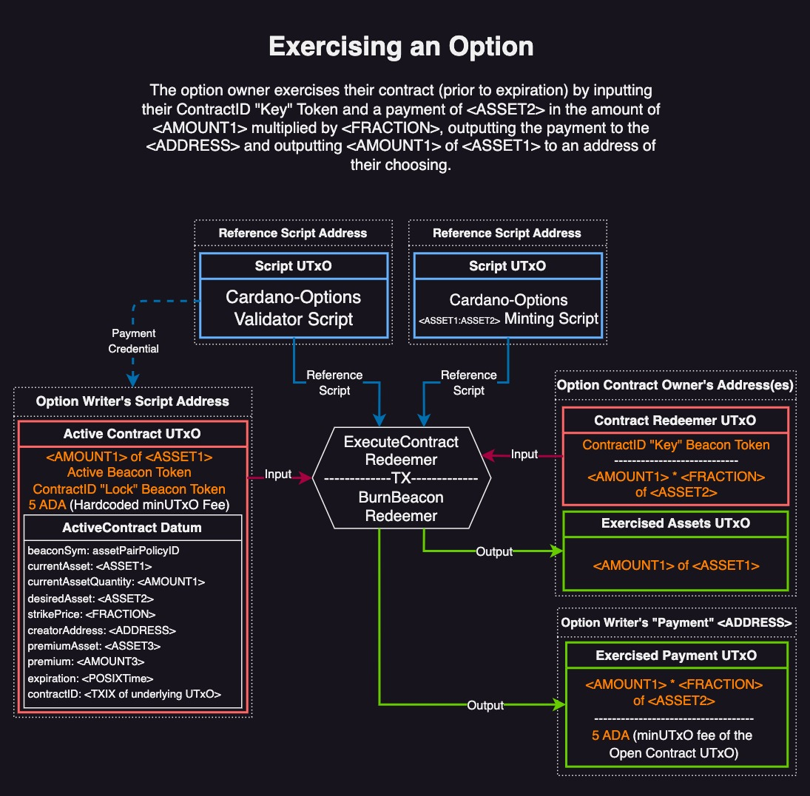
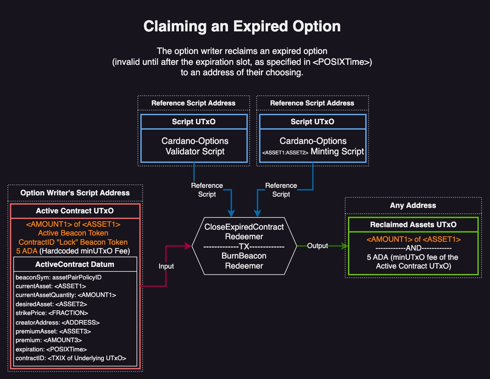

# Cardano-Options
A p2p derivatives protocol for writing, buying, and trading American-style *covered* options contracts on the Cardano Settlement Layer.

## Table of Contents
- [Abstract](#abstract)
- [Motivation](#motivation)
- [Preliminary Discussion](#preliminary-discussion)
- [Specification](#specification)
- [Features Discussion](#features-discussion)
- [Future Directions](#future-directions)
- [Conclusion](#conclusion)


## Abstract
Cardano-Options is a fully p2p protocol for writing, buying, and trading American-style *covered* options contracts on the Cardano Settlement Layer (CSL). Users maintain delegation control of assets at all times.

## Motivation
Options contracts play a vital role in the economy by providing a mechanism for risk management, improving market efficiency, and enhancing price discovery. This is especially important for an endogenous p2p economy that does not rely off-chain price feeds.

## Preliminary Discussion
Typically, options are explicitly categorized as either calls or puts. This is not necessary in Cardano-Options, since all assets on Cardano, including stablecoins, are first-class citizens. A call or a put is defined *implicitly*, based on the nature of the underlying "locked" asset. For example, a "put" option for ADA (priced in USD) is created by writing an option to swap ADA against a locked UTxO containing a stablecoin, such as DJED or USDA. For "call" options it would be the opposite - the locked UTxO contains ADA, to be swapped for a stablecoin. 

### The Cardano-Options Protocol
Users sell covered options contracts that are redeemable via a tradable NFT. 

##### The protocol is broadly comprised of three steps:

1. **Writing Option** - Alice writes a spread of options (in the form of multiple UTxOs with different datums) of varying *expiry dates, premiums, and strike prices*, against a single UTxO containing an asset.
   
2. **Buying Option** - Bob queries a list of all available options (for a given asset-pair) and decides to buy one that Alice is offering. He submits a transaction that pays Alice her premium, locks her asset(s) in a "contract" UTxO (at her address), and returns Bob an "exercise" token, to be used when exercising the option.

3. **Exercising Option** - The owner of the "exercise" token (Bob or someone he sold it to) queries the location of the contract UTxO. Provided the option has not yet expired, Bob can exchange the locked asset(s) for the requested asset(s). He must also burn the exercise token in the same transaction. If the option expires, Alice can unlock the "contract" UTxO and reclaim her assets.


## Specification
The protocol is composed of one validator script and multiple asset-pair specific minting policies that work together. All options, no matter how different the terms, use the same validator script. Minting policies are unique for every asset-pair.

### Components
An outline of the addresses, tokens, datums, and redeemers used in Cardano-Options

#### Option Writer's Script Address
The option writer creates an address whose payment credential is that of the Cardano-Options script, and a unique staking credential (key or script). This address will contain UTxOs with assets that cover contracts, as well as UTxOs with proposed contract terms (in the form of datums). Contracts of varying asset-pairs can all be written from this one address. Beacon Tokens with policyIDs unique to each asset-pair are minted in each UTxO, and are used to differentiate asset-pairs during querying. Owner related actions are "overloaded" to the staking credential, and the writer maintains full delegation control over all assets in the address. This includes "Active"/Open contracts - these are locked in the address, but their stake is still under control of the writer. 

#### Option Writer's Payment Address
The Option writer must specify a regular pubkey address where they will receive premium payments, and full payment if/when the option is exercised. This feature allows the writer to be paid directly, rather than being paid to the options address only to withdraw it to their personal address later. Script addresses cannot be used for this because Plutus currently requires that UTxOs in Plutus-guarded script addresses have attached datums. If a UTxO with the wrong (or no) datum ends up in a Plutus-guarded address, it will be locked forever. The contract exerciser cannot be trusted to output payments with proper datums, and enforcing this via Plutus is too resource-intensive. Therefore, writer's payment addresses are for now limited to simple key-based addresses.

#### Beacon Tokens
Cardano-Options uses 5 types of Beacon Tokens. All 5 have the same policy ID (unique for every asset pair), but different Token Names. The two Contract ID tokens have identical Token Names (unique for every contract). In addition to enforcing proper behavior, all of these tokens serve as Beacons:

1. **Assets Beacon** - demarcates asset UTxOs that underwrite options.
2. **Proposed Beacon** - demarcates contract UTxOs of varying parameters that refer back to the underwriting asset UTxO.
3. **Active Beacon** - demarcates all Active/Open contracts for a given asset pair.
4. **ContractID "Lock" Beacon** - demarcates the location of a specific Active/Open UTxO, corresponding to the twin ContractID "Key" Token. 
5. **ContractID "Key" Beacon** - this *is* the options contract. It is used to query the location of the underlying locked Active UTxO, and to exercise the option (prior to expiry). It can be freely traded like an NFT.
   
Having five such tokens makes querying the entire options market straightforward for users. A single query is very flexible in what it can filter. For example, prospective buyers on the secondary market can query the Active Beacon to see all open contracts of a given asset pair, compare their terms, and decide if the contract is worth buying. They can also query the Token name of the ContractID "Key" Beacon to find the exact location of the Active UTxO containing the twin ContractID "Lock" Beacon and underlying assets + Datum. 

#### Datums
Three different inline datums are used throughout the protocol to enforce contract terms. They are introduced here, and are expanded upon in the Lifecycle section below.

```Haskell
data OptionsDatum 
  = AssetsForContract -- ^ The datum for the UTxO containing the assets for the contract.
      { beaconSymbol :: CurrencySymbol -- ^ Policy Id for the relevant options beacon policy.
      , currentAsset :: (CurrencySymbol,TokenName)
      , currentAssetQuantity :: Integer
      , desiredAsset :: (CurrencySymbol,TokenName)
      }
  | ProposedContract
      { beaconSymbol :: CurrencySymbol -- ^ Policy Id for the relevant options beacon policy.
      , currentAsset :: (CurrencySymbol,TokenName)
      , currentAssetQuantity :: Integer
      , desiredAsset :: (CurrencySymbol,TokenName)
      , strikePrice :: Rational
      , creatorAddress :: Address
      , premiumAsset :: (CurrencySymbol,TokenName)
      , premium :: Integer
      , expiration :: POSIXTime -- ^ Slot where the contract will expire.
      }
  | ActiveContract
      { beaconSymbol :: CurrencySymbol -- ^ PolicyId for the relevant options beacon policy.
      , currentAsset :: (CurrencySymbol,TokenName)
      , currentAssetQuantity :: Integer
      , desiredAsset :: (CurrencySymbol,TokenName)
      , strikePrice :: Rational
      , creatorAddress :: Address
      , premiumAsset :: (CurrencySymbol,TokenName)
      , premium :: Integer -- ^ This field is kept for easy auditing.
      , expiration :: POSIXTime -- ^ Slot where the contract will expire.
      , contractId :: TokenName -- ^ Tx hash of the AssetsForContract UTxO used to create this UTxO.
      }
```

#### OptionConfig Parameter
The minting policy also uses the `OptionsConfig` parameter to enforce a unique minting policy for every asset-pair. This is similar in function to the `SwapConfig` parameter in Cardano-Swaps.

```Haskell
data OptionsConfig = OptionsConfig
  { currentAssetConfig :: (CurrencySymbol,TokenName)
  , desiredAssetConfig :: (CurrencySymbol,TokenName)
  }
```


#### Validator Redeemers
Validator redeemers are introduced here, their usage is explained further below.

```Haskell
data OptionsRedeemer
= CloseAssets -- Close an unused assetsForContract UTxO
| CloseProposedContracts -- Close unbought proposed UTxO(s)
| AcceptContract -- "Buy" a contract
| ExecuteContract -- Exercise a contract
| CloseExpiredContract -- reclaim an expired contract
| UpdateAddress -- Change the creatorAddress in an active contract
```

#### Minting Redeemers
Minting redeemers are introduced here, their usage is explained further below.

```Haskell
data OptionsBeaconRedeemer
  -- | Mint the AssetsBeacon for the AssetsForContract UTxO:
  = MintAssetsBeacon
  -- | Mint the beacons for proposed contracts:
  | MintProposedBeacons
  -- | Mint the Active beacon and ContractId for an accepted contract:
  | MintActiveBeacon
      TokenName -- ^ Tx hash of the AssetsForContract UTxO used to accept the contract
      Credential 
        -- ^ The staking credential for the options address being used. Either a script or pubkey
  | BurnBeacons
  deriving (Haskell.Show,Generic)
```

### Options Lifecycle
Below is an in-depth look at Cardano-Options logic.

#### 1. Underwriting & Creating Options
Options writers utilize the `MintAssetsBeacon` and `MintProposedBeacons` minting redeemers in two steps to create contracts that are easily queryable by prospective buyers.

##### Preparing Cover Assets:
Writers first create an AssetsForContract UTxO, which contains the asset that will underwrite their proposed options contracts, 5 ADA (hardcoded minUTxO fee), and the Assets Beacon Token. They must also specify which asset the contract will be priced in (their desired swap Asset).


The `MintAssetsBeacon` redeemer mints an `Assets` Beacon if and only if the following conditions are met:

1. Must only mint **one** token with the token name "Assets".
2. No other tokens can be minted/burned by this policy.
3. The Assets beacon must go to an address that uses the Cardano-Options validator as the spending credential.
4. The Assets beacon must go to an address that has a staking credential.
5. The receiving address must signal approval (via staking key or script).
6. The Assets beacon must be stored in a UTxO with the proper inline datum:
	- `beaconSymbol` == this policy id.
	- `currentAsset` == `currentAssetConfig` (from OptionsConfig)
	- `currentAssetQuantity` > 0
	- `desiredAsset` == `desiredAssetConfig` (from OptionsConfig)
7. The Asset Beacon must be stored with the proper value:
	- 5 ADA + `currentAsset` + `Asset Beacon`

> **Note**
> 5 ADA is used a min deposit to enforce fair circulation of minUTxO fees between the options writer/buyer. If it were not hardcoded, the buyer would be able to siphon some of the writer's minUTxO, depending on the size of the contract. This deposit is eventually returned to the writer.

##### Closing the "Cover" UTxO:
Writers can close/reclaim an AssetsForContract UTxO using the `BurnBeacon` minting redeemer and the `CloseAssets` validator redeemer. To do this, all of the following must conditions be true:

1. The UTxO must have an `AssetsForContract` datum.
2. All `Assets` Beacons among Tx inputs must be burned.
3. No `Active` beacons can be minted (this prevents combining redeemers and producing unexpected behaviors.)
4. The address' staking credential must signal approval (via key or script).

##### Writing Contract Offers:
Next, the writer may create one or many `ProposedContract` UTxOs of varying terms (expirations, premiums, strike prices) against a single `AssetsForContract` UTxO. Each `ProposedContract` UTxO must contain a `Proposed Beacon Token`, a Proposed Contract Datum, and 3 ADA (hardcoded minUTxO fee). 


The `MintProposedBeacons` redeemer mints Proposed Beacon(s) if and only if the following conditions are met:

1. Only tokens with the token name "`Proposed`" are minted. Multiple such tokens can be minted
2. No other tokens can be minted by this policy.
3. The `Proposed` Beacon(s) must go to an address that uses the Cardano-Options validator as the spending credential.
4. The `Proposed` Beacon(s) must go to an address that has a staking credential.
5. The receiving address must signal approval (via stake key-or-script).
6. The `Proposed` Beacon(s) must be stored with the proper `ProposedContract` datum:
	- `beaconSymbol` == this policy id
	- `currentAsset` == `currentAssetConfig`
	- `currentAssetQuantity` > 0
	- `desiredAsset` == `desiredAssetConfig`
	- `strikePrice` > 0
	- `creatorAddress` must use a payment *pubkey*
	- `premium` > 0
	- `expiration` > 0
7. Each Proposed beacon must be stored with the value:
	- 3 ADA + 1 `Proposed` Beacon 

> **Note**
> 3 ADA is enough here because there won't ever be value-assets stored in the proposal UTxOs, and all proposal UTxOs are roughly the same size. This deposit is enough for all the datum information, and is eventually returned to the writer during the premium payment.

##### Closing Proposed Contracts:
Writers can close/reclaim Proposed Contract UTxOs using the `BurnBeacon` minting redeemer and the `CloseProposedContracts` validator redeemer. To do this, all of the following conditions must be true:

1. The UTxO must have a `ProposedContract` datum.
2. All `Proposed` Beacons among Tx inputs must be burned.
3. No `Active` beacons can be minted (this prevents combining redeemers and producing unexpected behaviors.)
4. The address' staking credential must signal approval.

#### 2. Buying an Option Contract
Prospective buyers can search for available contracts by querying Asset and Proposed Beacons, which have unique policyIDs for every asset pair. Buyers buy a contract by constructing a transaction using the `MintActiveBeacon` minting redeemer and the `AcceptContract` validator redeemer. 


The `MintActiveBeacon` minting redeemer mints one `Active` Beacon and two `ContractID` Beacons, if and only if the following conditions are met:

1. The `Proposed` Beacon is burned
2. The `Assets` Beacon is burned
3. There are *exactly* two inputs from the writer's address:
	- One input must be an `AssetsForContract` UTxO with the proper `Assets` Beacon 
	- One input must be a `ProposedContract` UTxO with the proper `Proposed` Beacon 
	- The `AssetsForContract` UTxO input must have the Tx hash supplied by the `MintActiveBeacon` redeemer.
4. The datums of the two inputs must have identical matching fields:
	- `beaconSymbol`
	- `currentAsset`
	- `currentAssetQuantity`
5. There is exactly one output to the writer's address:
	- Must contain the same quantity of assets as in the `AssetForContract` UTxO, 1 `Active` Beacon Token, 1 `ContractID` Token, and 5 ADA
	- The datum fields of the output must exactly match the datum fields of the `ProposedContract` input, plus one extra field: `contractID` - whose value is the Tx hash supplied by the `AcceptContract` Redeemer

The `AcceptContract` Redeemer checks that the `Active`  Beacon Token is minted. This guarantees that the minting policy is executed in the same Tx (which is what enforces the actual logic). Since the protocol enforces that every transaction can only ever have one output with an `Assets` beacon, every valid `AssetsForContract` UTxO is cryptographically guaranteed to have a unique transaction hash. By extension, by using this hash as the `ContractID` token name for the newly created contract, every contract is cryptographically guaranteed to have a unique `ContractID` pair.

#### 3. Exercising an Option Contract
Whoever owns the ContractID "Key" Beacon Token can locate the underlying Active Contract UTxO (which contains the corresponding ContractID "Lock" Token) and exercise the option, until expiry. 



To exercise the contract, the contract owner uses the `BurnBeacon` minting redeemer and the `ExecuteContract` validator redeemer, which checks that all of the following conditions are met:

1. The input from the writer's address must have an `Active` Beacon.
2. The contract must not be expired (must be executed prior to `expiration` slot).
3. Exactly one `ContractID` is burned
4. All `Active` Beacons among the inputs are burned
5. The following must be output to the `creatorAddress` specified in the Active Datum:
	- 5 ADA (The writer's hardcoded minUTxO deposit)
	- `desiredAsset` in the amount of {`currentAssetQuantity` * `strikePrice`}
	- 1 `ContractID` Token

In the above example, the `contractID` "Key" Token and the Payment do not necessarily have to come from the same UTxO nor the same address.

> **Note**
> The second contractID token is not burned, and is instead used as a "receipt of payment" to guarantee unique outputs. This prevents double satisfaction, despite composing executions. Future versions of Cardano-Options may burn both ContractIDs (further explained in the [Future Directions](#future-directions) section).

##### Closing/Reclaiming an Expired Option
The option writer may reclaim expired options using the `BurnBeacon` minting redeemer and the `CloseExpiredContract` validator redeemer. 



To do this, all of the following conditions must be true:

1. The UTxO must have an `ActiveContract` datum.
2. The address' staking credential must signal approval (via key or script).
3. If the `Active Beacon` is present:
	- The contract must be expired (as per the `expiration` datum field)
	- All `ContractIDs` among Tx inputs must be burned
	- All `Active` Beacon(s) among Tx inputs must be burned

> **Note**
> This redeemer **can** be used to close ActiveContract UTxOs that are missing the Active Beacon (due to misconfiguration).

##### Updating Payment Address of an Active Option
Option writers may wish to update their desired payment address (the address which receives premium and payment, upon the Contract being exercised). They can do this with the `UpdateAddress` validator redeemer, which updates the `creatorAddress` datum field.


To do this, all of the following conditions must be met:

1. The `Active` beacon must be present in the UTxO. This implies the UTxO is an active contract with an `ActiveDatum`.
2. The new address must use a payment pubkey.
3. The new UTxO must be re-output to the same address as it came from.
4. The new UTxO must be exactly the same as the old UTxO (including asset values and datum fields), *except* for the updated `creatorAddress` field.
5. The address' staking credential must signal approval (via key or script).


## Features Discussion
A discussion of features unique to Cardano-Options.

### Trade-able Options Contracts
Querying the location and the right to exercise an (unexpired) option is fully encapsulated in the `ContractID` "Key" Beacon Token. These tokens can be traded on a secondary market, just like in traditional options markets. With enough liquidity, option buyers may buy options speculatively, with confidence they'd be able to sell them to a market maker (instead of having to exercise it themselves).

[cardano-secondary-market](https://github.com/fallen-icarus/cardano-secondary-market) is one such protocol specifically designed for trading Key Beacon tokens for any protocol using Lock and Key Beacon NFTs.

### Staking Script Credentials
Since owner-related actions of script addresses are overloaded to the staking credentials, users can secure their addresses either with a simple stake key or a more complex stake script (Native or Plutus). In the case of simple stake key, a regular signature from the stake key will suffice. In the case of a script however, the staking script must be executed (i.e. withdraw 0 ADA from rewards) in the same TX. This means stake address registration is not necessary when using simple stake keys, but is necessary when using staking scripts.

### Interoperability & Composability
Cardano-Options is fully composable with Cardano-Swaps, down to the TX level. For example, when exercising an option, payment can be an input from a swap that is executed in the same TX. Below is an example where Alice exercises an option to buy 1000 ADA for 500 DJED, where the DJED comes from a USDA:DJED swap address.


-------

### Fee Estimations
| Transaction Type | Fee Estimation |
|--|--|
| Create One Underlying UTxO | 0.628372 ADA |
| Create One Proposal UTxO | 0.626045 ADA |
| Create Two Proposal UTxOs | 0.703411 ADA |
| Create Three Proposal UTxOs | 0.780778 ADA |
| Close an Underlying UTxO | 0.797346 ADA |
| Close One Proposal UTxO | 0.802720 ADA |
| Close Two Proposal UTxOs | 0.935584 ADA |
| Close Three Proposal UTxOs | 1.133239 ADA |
| Buy an Options Contract | 1.111633 ADA |
| Close an Expired Contract UTxO | 0.826764 ADA |
| Burn expired contractID | 0.553654 ADA |
| Exercise Contract (simple) | 1.033613 ADA |
| Update Address | 0.575059 ADA |


## Future Directions
Being a PoC, v1 of Cardano-Options is intended to demonstrate the capacity for a fully p2p options market on the CSL. As such, there are a number of features that may be implemented in future version of the protocol, discussed below.

### Script-based Payment Addresses
With further optimizations to Plutus Core, more efficient languages, increased execution limits, or all three, it may be possible to enforce that the option exerciser outputs payments to the writer with proper datums. Alternatively, Plutus Core may be updated such that scripts may be executed even if there is no datum.

### Burning Both ContractID Tokens
Currently, one of the ContractIDs is burned when an option is exercised, and the other is included in one of the outputs to prevent double satisfaction. Future versions of Cardano-Options may instead burn both, and prevent double satisfaction via datums. This would mitigate the number of "used" ContractIDs floating around, thereby decreasing Tx and UTxO bloat.

### Variable minUTxO Deposits
Currently, there are hardcoded minUTxO deposits (5 ADA for the "AssetsForContract" UTxO, and 3 ADA for each "Proposal" UTxO). This prevents option buyers from siphoning deposits, and ensures minUTxO fees are eventually returned to the writer. Instead of hardcoding this deposit, future versions of the protocol may introduce a new "deposit" datum field that would enable variable deposit fees.

### Buying Multiple Options in One Transaction
Currently, multiple options cannot be bought in a single transaction. This was done for the sake of v1 simplicity, but future versions of Cardano-Options may support buying multiple options in one transaction. This would lower fees and increase throughput of the protocol.

### Underlying Assets & Proposal Consolidation
Currently, it takes one transaction to prepare the underlying "Assets For Contract" UTxO, and another transaction to write contract proposal UTxOs against the underlying. This may be consolidated into one transaction, where the underlying and the proposals are output simultaneously. This would lower fees and increase throughput of the protocol.

### Expired Option Rollovers
Most option writers are in the business of writing options regularly, and will often "rollover" expired options into new offers. Currently, this takes two transactions (one for reclaiming an expired option, and another to prepare a new asset UTxO). With the addition of a new redeemer, it may be possible to consolidate this rollover into a single transaction. This would lower fees and increase throughput of the protocol.


## Conclusion
Cardano-Options is the latest addition to a family of p2p-DeFi protocols that enables users to build a fully endogenous economy on the CSL. By embracing radical permissionlessness, simplicity, and interoperability, Cardano-Options enables a secure, censorship-resistant options market on Cardano.

## Feedback
Any feedback that can help improve the protocol is welcome! If you have any ideas, feel free to use either the Issue section or Discussion section of this repo. The Discussion section can also be used to ask any questions.
